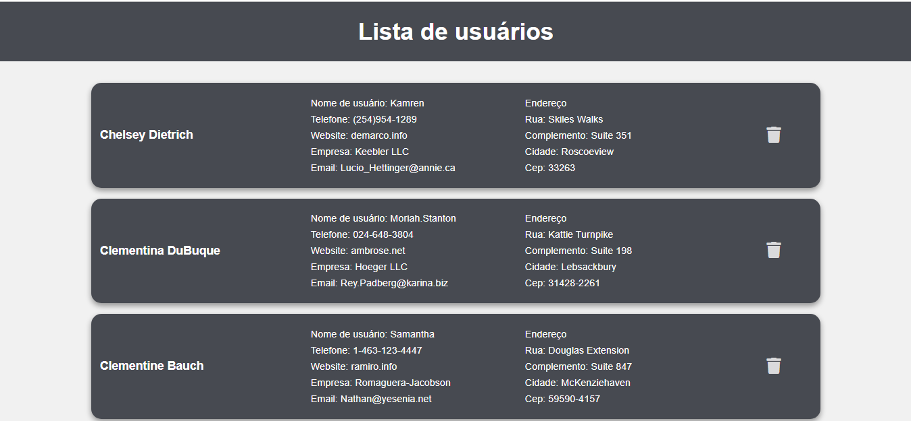

<h1 align="center">Consumes API Users - React.js</h1>

### :mag: Sobre o projeto

É uma aplicação web que consome uma API de testes disponível em (https://jsonplaceholder.typicode.com/users) e exibe como uma listagem os usuários recuperados utilizando componentes personalizados, tendo opção de exclusão de cada item da lista.

### 🛠️ Tecnologias

- HTML
- CSS
- JavaScript
- React

### :key: Executar a aplicação

Abrindo a pasta do projeto, executar os comandos:  
$ npm install  
$ npm run  

### :bulb: Melhorias
[ ] Adicionar usuários;  
[ ] Edição de usuários;  
[ ] Alteração de template;

Com 💜 por Raissa Boeng

